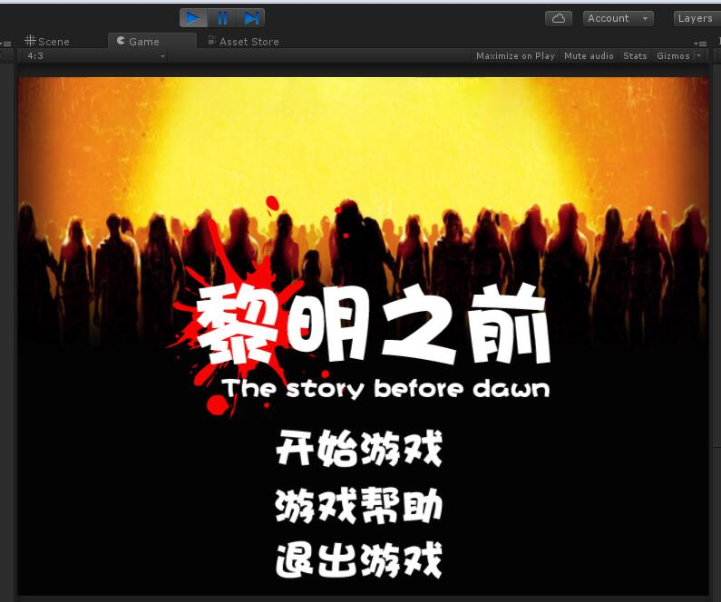
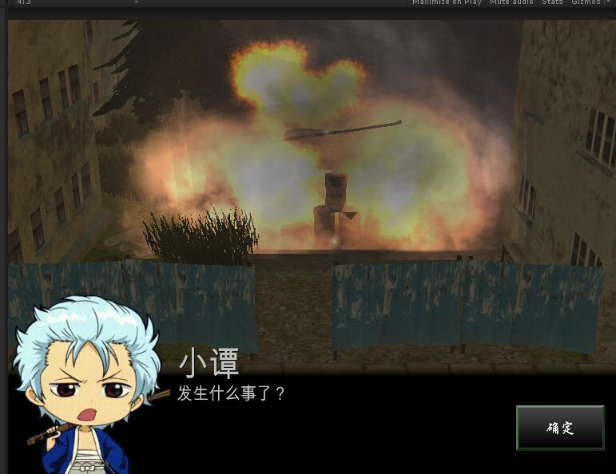
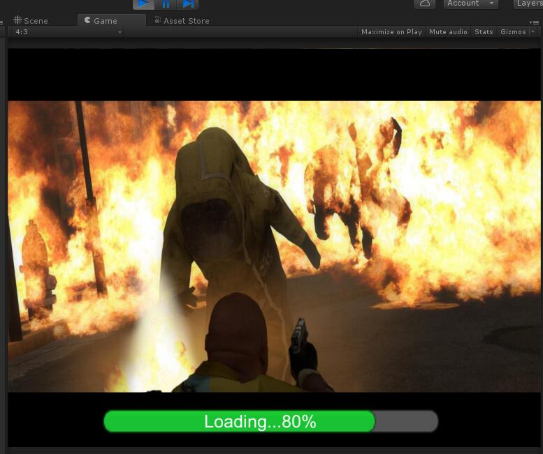
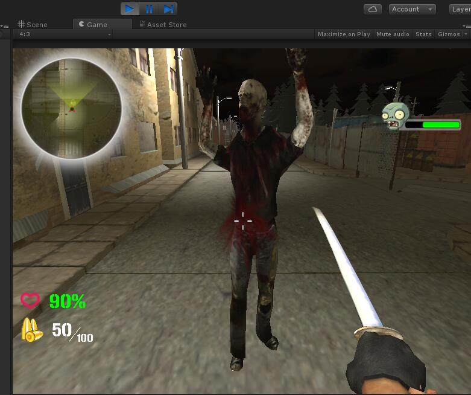

# BeforeDawn
<ul>
    <li>游戏名称：黎明之前</li>
    <li>游戏类型：第一人称射击</li>
    <li>版本：Unity5.2.1</li>
    <li>简介：本人的毕业设计《黎明之前》，整合了所有我在学习Unity3D过程中所学到的知识。
    其中包含了：
    <ol type="1">
    <li>UGUI和NGUI的简单交互。</li>
    <li>子弹射击过程的制作</li>
    <li>爆炸特效，武器火花特效，受伤流血特效等。</li>
    <li>场景切换，加载进度条。</li>
    <li小地图，大地图的制作。</li>
    <li>怪物的自动巡逻，追踪目标。</li>
    <li>简单的剧情过场，对话交互。</li>
    <li>好像就这么多了，我也不太记得了.....</li>
   </ol>
   </li> 
</ul>
 游戏相关截图：
 
 
 
 